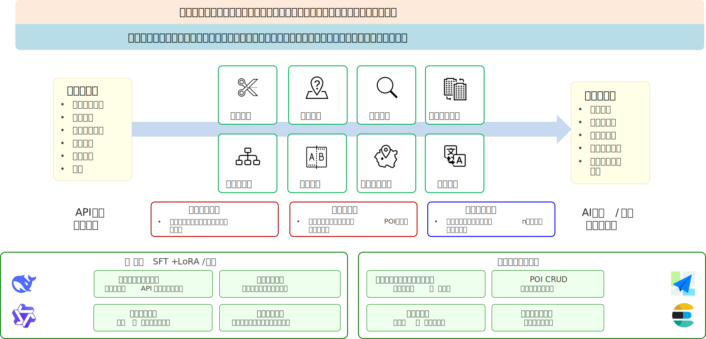
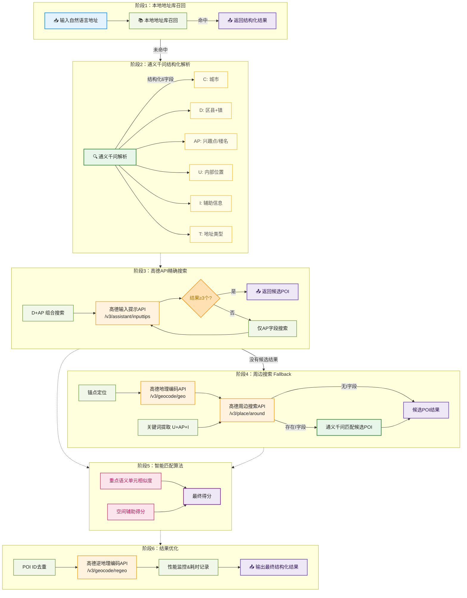

# 地址解析引擎 (AddrResolver)



结合高德地图API和通义千问大语言模型，能够将自然语言地址智能解析为结构化数据，并提供地图定位功能。

## 🌟 主要功能

- **智能地址解析**: 将自然语言地址解析为结构化字段（城市、区县、兴趣点、门牌号等）
- **多源数据融合**: 结合高德地图API和通义千问模型，提供高精度的地址匹配
- **Web界面**: 提供友好的Web界面进行地址解析和结果展示
- **RESTful API**: 支持API调用，便于集成到
- **地图定位**: 集成高德地图，可视化显示解析结果
- **私有化地址库**：支持私有化地址库功能，支持地图点选地址录入，支持多标签管理，召回时优选选取
- **Docker部署**: 支持Docker容器化部署

## 🏗️ 系统架构

```
AddrResolver/
├── app.py                 # Flask Web应用主文件
├── address_resolver.py    # 核心地址解析逻辑
├── similarity.py          # 相似度计算模块
├── struct_prompt.md       # 大模型提示词模板
├── templates/
│   └── index.html         # Web界面模板
├── config.ini.sample      # 配置文件模板
├── requirements.txt       # Python依赖包
├── Dockerfile            # Docker镜像构建文件
├── docker-compose.yml    # Docker Compose配置
└── logs/                 # 日志目录
```

## 🔍 核心处理逻辑



### 1. 地址结构化处理
系统首先使用通义千问大语言模型将自然语言地址解析为6个结构化字段：

| 字段 | 说明 | 示例 |
|------|------|------|
| **C** | 直辖市、地级市（删除省一级信息） | "宁波市" |
| **D** | 区县 + 街道/镇，不包含道路信息 | "慈溪市长河镇" |
| **AP** | 兴趣点/小区/社区/道路/研究所 + 楼名/楼宇编号 | "云海村南3号" |
| **U** | 单元、门牌、楼栋、房号等内部位置信息 | "1单元201室" |
| **I** | 辅助信息（如"附近"、"对面"、"门口"等） | "北门附近" |
| **T** | 该地址所属的类型 | "商务住宅" |

### 2. 高德地图API集成

系统集成了以下4个高德地图API接口：

| API接口 | 接口地址 | 主要功能 | 使用场景 |
|---------|----------|----------|----------|
| **输入提示API** | `/v3/assistant/inputtips` | 模糊搜索POI，支持城市限定 | 精确搜索阶段，使用D+AP字段组合搜索 |
| **地理编码API** | `/v3/geocode/geo` | 将地址文本转换为经纬度坐标 | 周边搜索的锚点定位 |
| **逆地理编码API** | `/v3/geocode/regeo` | 将经纬度坐标转换为详细地址信息 | 补充POI的乡镇街道等详细信息 |
| **周边搜索API** | `/v3/place/around` | 以指定坐标为中心搜索周边POI | Fallback阶段，当精确搜索无结果时使用 |

### 3. 多阶段POI搜索策略

#### 阶段1：精确搜索
- 使用 `D + AP` 字段组合作为搜索关键词
- 调用**高德输入提示API**进行精确匹配
- 如果结果少于3个，则使用 `AP` 字段单独搜索

#### 阶段2：周边搜索（Fallback）
当精确搜索无结果时，系统启动周边搜索：
1. **锚点定位**: 使用**高德地理编码API**，优先使用 `AP` 字段，失败则使用 `D` 字段
2. **关键词提取**: 从 `U`、`AP`、`I` 字段中提取搜索关键词
3. **周边搜索**: 调用**高德周边搜索API**，以锚点为中心，使用提取的关键词搜索周边POI
4. **大模型辅助**: 当存在辅助信息（`I`字段）时，调用通义千问判断各候选POI的匹配程度

### 4. 智能匹配算法

#### 相似度计算
系统使用多维度相似度计算：
- **文本相似度** (70%权重): 基于分词和关键词重叠率
- **空间辅助得分** (30%权重): 基于大模型对辅助信息的理解

#### 最终评分公式
```
最终得分 = 0.7 × 文本相似度 + 0.3 × 空间辅助得分
```

### 5. 结果优化
- 自动去重：基于POI ID合并搜索结果
- 逆地理编码：使用**高德逆地理编码API**补充乡镇街道等详细信息
- 性能监控：记录处理耗时

## 📋 API返回字段说明

系统返回的JSON对象包含以下字段：

| 字段 | 类型 | 说明 |
|------|------|------|
| `id` | string | POI的唯一标识符 |
| `name` | string | POI名称 |
| `address` | string | POI详细地址 |
| `location` | string | 经纬度坐标（经度,纬度） |
| `regeo` | object | 逆地理编码信息（乡镇街道等） |
| `similarity` | float | 文本相似度得分（0-100） |
| `auxiliary` | float | 空间辅助得分（0-100） |
| `score` | float | 最终匹配得分（0-100） |
| `duration` | float | 处理耗时（秒） |

## 🚀 快速开始

### 环境要求

- Python 3.10+
- Docker (可选，用于容器化部署)

### 1. 克隆项目

```bash
git clone <repository-url>
cd AddrResolver
```

### 2. 安装依赖

```bash
pip install -r requirements.txt
```

### 3. 配置API密钥

复制配置文件模板并填入您的API密钥：

```bash
cp config.ini.sample config.ini
```

编辑 `config.ini` 文件：

```ini
[key]
amap_key = 您的高德地图API密钥
llm_api_key = 您的阿里云百炼API密钥
qwen_model = qwen-turbo-2025-04-28
```

**获取API密钥：**
- [高德地图开放平台](https://lbs.amap.com/) - 获取高德API密钥
- [阿里云百炼](https://bailian.console.aliyun.com/) - 获取通义千问API密钥

### 4. 运行应用

```bash
python app.py
```

访问 http://localhost:5000 即可使用Web界面。

## 🐳 Docker部署

### 构建镜像

```bash
docker build -t scisaga/addr-resolver:latest .
```

### 推送镜像（可选）

```bash
docker push scisaga/addr-resolver:latest
```

### 使用Docker Compose部署

1. 设置环境变量（创建 `.env` 文件）：

```env
AMAP_KEY=高德地图API密钥
LLM_API_KEY=阿里云百炼API密钥
QWEN_MODEL=qwen-turbo-2025-04-28
```

2. 启动服务：

```bash
docker compose up -d --pull always
```

3. 访问应用：

打开浏览器访问 http://localhost:5000

## 📖 使用说明

### Web界面使用

1. 在输入框中输入需要解析的地址
2. 点击"解析"按钮
3. 系统将返回结构化的解析结果和地图定位

### API调用

#### 解析地址

```bash
GET /api/resolve?addr=地址文本
```

**示例：**

```bash
curl "http://localhost:5000/api/resolve?addr=浙江宁波市慈溪市长河镇长河镇云海村陆家路南3号"
```

**响应示例：**

```json
{
  "id": "B0FFJQXXXX",
  "name": "云海村南3号",
  "address": "浙江省宁波市慈溪市长河镇云海村陆家路南3号",
  "location": "121.594637,29.725989",
  "regeo": {
    "country": "中国",
    "province": "浙江省",
    "city": "宁波市",
    "district": "慈溪市",
    "township": "长河镇"
  },
  "similarity": 85.6,
  "auxiliary": 0.0,
  "score": 59.9,
  "duration": 2.34
}
```

## 🔧 配置说明

### 环境变量

| 变量名 | 说明 | 默认值 |
|--------|------|--------|
| `AMAP_KEY` | 高德地图API密钥 | 从config.ini读取 |
| `LLM_API_KEY` | 阿里云百炼API密钥 | 从config.ini读取 |
| `QWEN_MODEL` | 通义千问模型名称 | qwen-turbo-2025-04-28 |

### 日志配置

日志文件保存在 `logs/` 目录下：
- `address_resolver.log` - 地址解析相关日志

## 🧪 测试

项目包含测试文件：

```bash
# 运行单元测试
python test_address_resolver.py

# 运行真实场景测试
python test_address_resolver_real.py
```

## 🤝 贡献

欢迎提交Issue和Pull Request来改进这个项目。

## 📄 许可证

本项目采用MIT许可证。

## 🔗 相关链接

- [高德地图开放平台](https://lbs.amap.com/)
  - [Web服务 搜索POI](https://lbs.amap.com/api/webservice/guide/api-advanced/search)
  - [Web服务 输入提示](https://lbs.amap.com/api/webservice/guide/api-advanced/inputtips)
  - [快速接入高德地图 MCP Server](https://lbs.amap.com/api/mcp-server/gettingstarted)
- [阿里云百炼](https://bailian.console.aliyun.com/)
- [Flask框架](https://flask.palletsprojects.com/)
- [通义千问](https://qianwen.aliyun.com/)